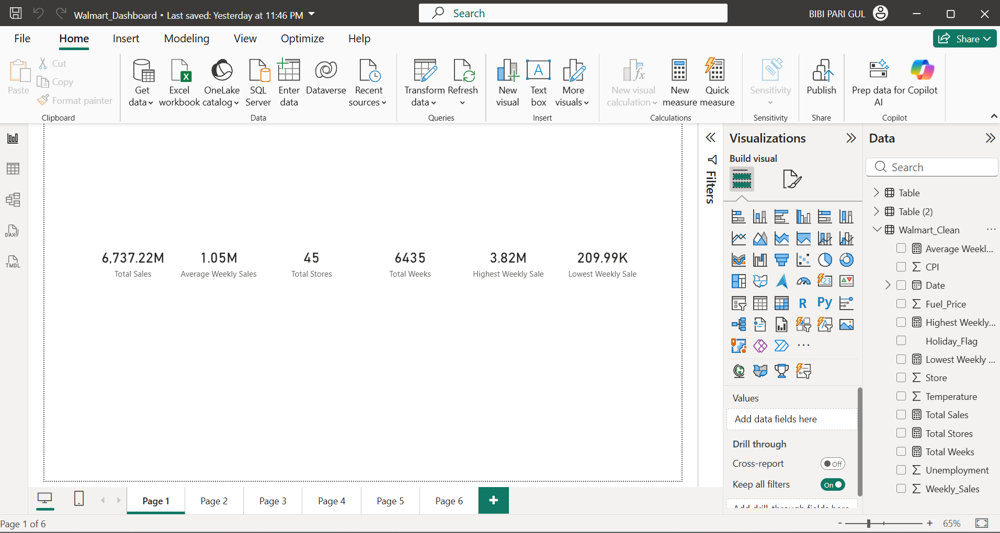

# 🛒 Walmart Sales Intelligence Dashboard

## Turning Walmart Sales Data into Business Decisions



> **An end-to-end Business Intelligence project that transforms Walmart sales data into actionable business insights using SQL and Power BI. Rather than simply reporting numbers, this project identifies operational inefficiencies, evaluates store performance, uncovers seasonal demand patterns, and provides strategic recommendations to support executive decision-making.**

---

# 📌 Project Overview

Retail organizations generate enormous amounts of sales data every day, but data alone does not improve business performance.

This project demonstrates how Business Intelligence can convert raw transactional data into meaningful business decisions. Using SQL for data preparation and analysis, and Power BI for interactive visualization, the project evaluates sales performance across 45 Walmart stores between February 2010 and October 2012.

The objective was not only to analyze historical sales, but to answer the questions that matter most to management:

- Which stores require immediate attention?
- Why are some stores consistently outperforming others?
- How do holidays influence sales performance?
- Do external economic factors explain performance differences?
- Where should Walmart invest its operational resources?

---

# 🎯 Business Objectives

- Analyze overall sales performance across the Walmart network.
- Benchmark store performance and identify high- and low-performing locations.
- Evaluate seasonal and holiday sales patterns.
- Examine the influence of external factors such as temperature, fuel price, CPI, and unemployment.
- Develop an executive dashboard to support data-driven decision-making.

---

# 📊 Executive Dashboard

The interactive Power BI dashboard provides management with a real-time overview of business performance.

### Dashboard Features

- Executive KPI Summary
- Sales Trend Analysis (Yearly, Quarterly, Monthly)
- Store Performance Analysis
- Top 10 Best Performing Stores
- Bottom 10 Performing Stores
- Holiday vs Non-Holiday Sales
- Temperature vs Weekly Sales
- Interactive Filtering and Drill-down

---

# 📈 Key Business Insights

The analysis revealed several important findings:

- Six stores generate more than 25% of total company revenue.
- Nearly 60% of stores perform below the company-wide average weekly sales.
- Holiday periods increase average weekly sales, although several stores underperform during peak demand.
- Sales follow predictable seasonal patterns, enabling proactive inventory and workforce planning.
- Store-level operational execution has a greater impact on sales performance than external economic conditions.

---

# 💡 Strategic Recommendations

Based on the findings, the following actions are recommended:

- Prioritize operational improvements in underperforming stores.
- Replicate best practices from top-performing locations.
- Increase inventory and staffing before peak seasonal demand.
- Strengthen holiday promotion and operational planning.
- Continuously monitor KPIs through an interactive Business Intelligence dashboard.

---

# 🛠️ Technologies Used

| Technology | Purpose |
|------------|---------|
| SQL | Data Cleaning & Analysis |
| SQL Server / SQLite | Database Management |
| Power BI | Dashboard Development |
| Microsoft PowerPoint | Executive Presentation |

---

# 📂 Repository Structure

```
📦 walmart-sales-insights-dashboard
│
├── data/
├── images/
├── powerbi/
├── presentation/
├── report/
├── sql/
└── README.md
```

---

# 🚀 Business Value

This project demonstrates how Business Intelligence extends beyond reporting by transforming data into strategic business actions.

The insights generated help managers:

- Identify revenue opportunities.
- Detect operational inefficiencies.
- Allocate resources more effectively.
- Improve inventory planning.
- Support executive decision-making through interactive dashboards.

---

# 👤 Author

**Bibi Pari Gul**

Business Intelligence Analyst

---

> **"Data becomes valuable only when it drives better decisions."**
